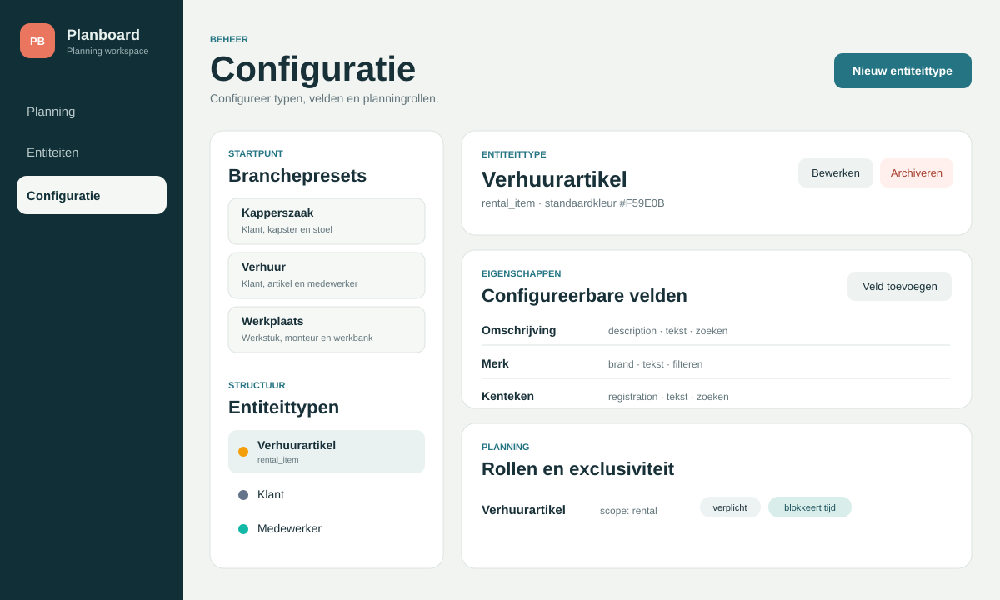
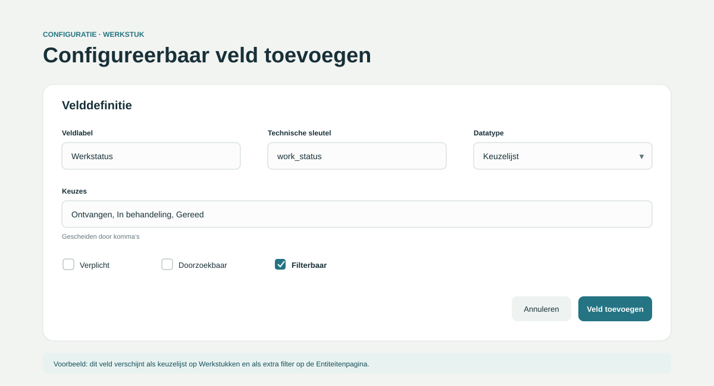
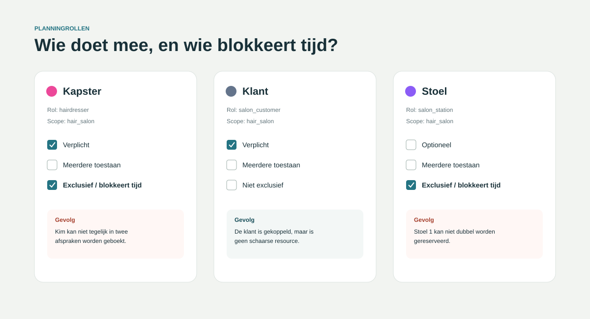
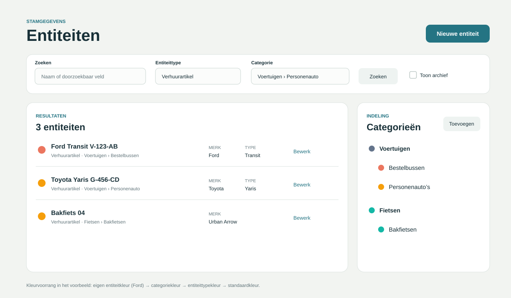

# Planboard gebruikershandleiding

Deze handleiding beschrijft hoe je Planboard configureert en hoe je de stamgegevens voor
verschillende soorten organisaties opbouwt. De nadruk ligt op het configuratiegedeelte: presets,
entiteittypen, configureerbare velden, planningrollen, exclusiviteit, kleuren en categorieën.

> **Versie van deze handleiding**  
> Deze tekst sluit aan op ontwikkelstap 7. Configuratie- en entiteitenbeheer zijn beschikbaar. De
> volledige boekingsworkflow, drag-and-drop en de gedeelde kalender-/lijstfilters worden in de
> volgende ontwikkelstappen toegevoegd. Onderdelen die nog niet beschikbaar zijn, zijn expliciet
> als *toekomstig* gemarkeerd.

> **Over de afbeeldingen**  
> De ingebouwde browsertab kon tijdens het schrijven niet automatisch worden vastgelegd. De
> afbeeldingen zijn daarom PDF-veilige, representatieve schermillustraties die zijn opgebouwd uit
> de actuele Planboard-interface en de lokaal geïnstalleerde presets. Ze kunnen later zonder
> wijziging van de tekst worden vervangen door echte screenshots met dezelfde bestandsnamen.

## Inhoud in één oogopslag

1. [Snel beginnen](#1-snel-beginnen)
2. [De belangrijkste begrippen](#2-de-belangrijkste-begrippen)
3. [Configuratie stap voor stap](#3-configuratie-stap-voor-stap)
4. [Entiteiten en categorieën beheren](#4-entiteiten-en-categorieën-beheren)
5. [Praktijkvoorbeeld: kapperszaak](#5-praktijkvoorbeeld-kapperszaak)
6. [Praktijkvoorbeeld: verhuurorganisatie](#6-praktijkvoorbeeld-verhuurorganisatie)
7. [Praktijkvoorbeeld: reparatiewerkplaats](#7-praktijkvoorbeeld-reparatiewerkplaats)
8. [Ontwerpregels en veelgemaakte fouten](#8-ontwerpregels-en-veelgemaakte-fouten)
9. [Problemen oplossen](#9-problemen-oplossen)
10. [Van Markdown naar PDF](#10-van-markdown-naar-pdf)

\newpage

# 1. Snel beginnen

## 1.1 Planboard openen

Start de backend en frontend volgens de README en open daarna:

- **Planning:** `http://localhost:5173/planning`
- **Entiteiten:** `http://localhost:5173/entities`
- **Configuratie:** `http://localhost:5173/configuration`

Linksonder toont Planboard de API-status. Begin pas met configureren wanneer daar **API online**
staat. Een offline melding betekent meestal dat de FastAPI-backend niet draait.

## 1.2 Aanbevolen volgorde voor een nieuwe organisatie

Gebruik bij een lege installatie deze volgorde:

1. Kies een branchepreset die het dichtst bij de organisatie ligt.
2. Controleer welke entiteittypen door de preset zijn aangemaakt.
3. Pas per entiteittype de naam, standaardkleur en velden aan.
4. Controleer de planningrollen en vooral de instelling **Exclusief**.
5. Maak categorieën en eventuele subcategorieën aan.
6. Maak concrete entiteiten aan, zoals klanten, medewerkers en artikelen.
7. Controleer zoeken en filteren op de Entiteitenpagina.
8. Maak pas daarna boekingen aan zodra de boekingsinterface beschikbaar is.

> **Praktische tip**  
> Begin klein. Een werkende configuratie met drie typen en vijf goede velden is waardevoller dan
> twintig typen met onduidelijke rollen en dubbele gegevens.

# 2. De belangrijkste begrippen

## 2.1 Entiteittype

Een **entiteittype** beschrijft een soort persoon, object of resource. Voorbeelden:

- Klant
- Kapster
- Stoel
- Verhuurartikel
- Monteur
- Werkbank
- Werkstuk

Een entiteittype bepaalt:

- welke configureerbare velden zichtbaar zijn;
- hoe een entiteit in een boeking mag deelnemen;
- of de entiteit standaard een kalenderkleur heeft;
- welke eigenschappen doorzoekbaar of filterbaar zijn.

## 2.2 Entiteit

Een **entiteit** is één concreet exemplaar van een entiteittype. Bijvoorbeeld:

| Entiteittype | Concrete entiteit |
|---|---|
| Klant | Sophie de Vries |
| Kapster | Kim Jansen |
| Stoel | Stoel 1 |
| Verhuurartikel | Ford Transit V-123-AB |
| Werkstuk | Klep SN-2026-0042 |
| Werkbank | Werkbank 3 |

Iedere entiteit heeft altijd een naam en type. Daarnaast kan de entiteit een categorie, eigen kleur
en waarden voor de configureerbare velden hebben.

## 2.3 Velddefinitie

Een **velddefinitie** bepaalt welke extra gegevens bij entiteiten van een bepaald type worden
opgeslagen. Een veld heeft:

- een zichtbaar label, bijvoorbeeld `Telefoon`;
- een technische sleutel, bijvoorbeeld `phone`;
- een datatype;
- optioneel de eigenschappen **Verplicht**, **Doorzoekbaar** en **Filterbaar**.

## 2.4 Planningrol

Een **planningrol** bepaalt hoe een entiteittype deelneemt aan een boeking. Eén afspraak bij een
kapperszaak kan bijvoorbeeld bestaan uit:

- Sophie de Vries als **Klant**;
- Kim Jansen als **Kapster**;
- Stoel 1 als **Stoel**.

De rol is dus niet hetzelfde als een gebruikersrecht. Planboard is momenteel single-user; rollen
beschrijven deelnemers aan de planning.

## 2.5 Booking scope

De **booking scope** groepeert rollen die bij dezelfde workflow horen. De rollen Klant, Kapster en
Stoel gebruiken bijvoorbeeld allemaal `hair_salon`. Rollen met verschillende scopes mogen niet
onbedoeld in dezelfde boeking worden gecombineerd.

Gebruik korte, stabiele technische scopes:

- `hair_salon`
- `rental`
- `repair_workshop`

## 2.6 Categorie

Een **categorie** deelt entiteiten hiërarchisch in. Een categorie kan een bovenliggende categorie
hebben:

```text
Voertuigen
├── Bestelbussen
└── Personenauto's
Fietsen
└── Bakfietsen
```

Een entiteit hoort in de huidige MVP bij maximaal één categorie. De boom mag wel meerdere niveaus
diep zijn. Filteren op een bovenliggende categorie omvat ook de onderliggende categorieën.

# 3. Configuratie stap voor stap

## 3.1 De configuratiepagina begrijpen

Open **Configuratie** via de hoofdnavigatie. De pagina bestaat uit:

- links de drie branchepresets en de lijst met entiteittypen;
- rechts de geselecteerde type-instellingen;
- daaronder de configureerbare velden;
- onderaan de planningrollen en exclusiviteit.



*Afbeelding 1 — Configuratieoverzicht met de Verhuur-preset en het entiteittype
Verhuurartikel.*

## 3.2 Een branchepreset installeren

Planboard bevat drie startpresets:

| Preset | Entiteittypen | Typische workflow |
|---|---|---|
| Kapperszaak | Klant, Kapster, Stoel | afspraak met medewerker en optionele stoel |
| Verhuur | Klant, Verhuurartikel, Medewerker | reservering van een schaars artikel |
| Werkplaats | Werkstuk, Monteur, Werkbank | opdracht met monteur en werkplek |

Zo installeer je een preset:

1. Open **Configuratie**.
2. Klik links op **Kapperszaak**, **Verhuur** of **Werkplaats**.
3. Wacht op de groene succesmelding.
4. Controleer de nieuwe entiteittypen in de lijst.
5. Open ieder type en controleer de velden en rollen.

Een preset is een startpunt, geen beperking. Na installatie kun je typen, velden, kleuren en rollen
aanpassen of uitbreiden.

> **Let op bij herhaald installeren**  
> Technische sleutels moeten uniek blijven. Als een preset of sleutel al bestaat, toont Planboard
> een conflictmelding en worden geen onvolledige dubbele definities aangemaakt.

## 3.3 Een entiteittype maken

Klik rechtsboven op **Nieuw entiteittype** en vul in:

### Naam

De naam is zichtbaar voor gebruikers. Kies een enkelvoudige, herkenbare naam zoals `Voertuig`,
`Behandelkamer` of `Monteur`.

### Technische sleutel

De technische sleutel wordt in de API en configuratie gebruikt. Gebruik:

- alleen kleine letters;
- cijfers waar nodig;
- underscores tussen woorden;
- geen spaties of leestekens.

Goede voorbeelden:

```text
vehicle
treatment_room
rental_customer
```

Vermijd:

```text
Verhuur Artikel
klant-type!
Type1 met spaties
```

### Standaardkleur

De standaardkleur wordt gebruikt wanneer een concrete entiteit en diens categorie geen eigen kleur
hebben. Kies kleuren met voldoende onderling contrast.

## 3.4 Een entiteittype bewerken of archiveren

1. Selecteer links het entiteittype.
2. Klik op **Bewerken**.
3. Pas naam of standaardkleur aan.
4. Sla het formulier op.

Gebruik **Archiveren** als een type niet meer gebruikt mag worden. Archiveren is veiliger dan
verwijderen: historische relaties blijven behouden. Planboard vraagt eerst om bevestiging.

> **Aanbeveling**  
> Verander een technische sleutel niet lichtvaardig zodra een configuratie in gebruik is. De
> zichtbare naam mag wel worden verbeterd zonder de betekenis van integraties te veranderen.

## 3.5 Configureerbare velden toevoegen

Selecteer een entiteittype en klik bij **Configureerbare velden** op **Veld toevoegen**.



*Afbeelding 2 — Een filterbaar keuzelijstveld `Werkstatus` voor het type Werkstuk.*

### Ondersteunde datatypen

| Datatype | Gebruik | Voorbeelden |
|---|---|---|
| Tekst | korte of vrije tekst | telefoon, kenteken, serienummer |
| Getal | numerieke waarde | capaciteit, tarief, gewicht |
| Ja/nee | binaire eigenschap | elektrisch, gecertificeerd, beschikbaar |
| Datum | kalenderdatum zonder tijd | keuringsdatum, geboortedatum |
| Keuzelijst | vaste toegestane waarden | status, segment, voertuigklasse |

### Verplicht

Zet **Verplicht** aan wanneer een entiteit zonder deze waarde niet bruikbaar is. Voorbeelden:

- een serienummer voor een individueel werkstuk;
- een kenteken voor een verhuurauto;
- een status voor een werkplaatsproces.

Maak velden niet verplicht “voor de zekerheid”. Dat vertraagt invoer en leidt vaak tot tijdelijke
nepwaarden.

### Doorzoekbaar

Zet **Doorzoekbaar** aan als gebruikers de waarde via het vrije zoekveld moeten kunnen vinden.

Goede kandidaten:

- klantnaam en telefoonnummer;
- kenteken;
- serienummer;
- korte omschrijving.

### Filterbaar

Zet **Filterbaar** aan als gebruikers entiteiten op een exacte waarde of keuze moeten kunnen
selecteren.

Goede kandidaten:

- merk;
- voertuigtype;
- werkstatus;
- gecertificeerd ja/nee;
- capaciteit of datum wanneer exact filteren nuttig is.

### Doorzoekbaar versus filterbaar

| Vraag | Instelling |
|---|---|
| “Vind het artikel met kenteken V-123-AB.” | Doorzoekbaar |
| “Toon alle voertuigen van Ford.” | Filterbaar |
| “Zoek klant op telefoonnummer.” | Doorzoekbaar |
| “Toon alle werkstukken met status Gereed.” | Filterbaar |

Een veld mag beide eigenschappen hebben, maar dat is niet altijd nodig.

### Keuzelijsten ontwerpen

Vul keuzes kommagescheiden in. Gebruik duidelijke labels:

```text
Ontvangen, In behandeling, Gereed
```

Houd de lijst beheersbaar. Als waarden zelf uitgebreid beheer, kleuren of planningrollen nodig
hebben, is een apart entiteittype of categorie meestal geschikter.

## 3.6 Planningrollen configureren

Selecteer een entiteittype en klik bij **Rollen en exclusiviteit** op **Rol toevoegen**.

Een rol bevat minimaal:

- een technische sleutel;
- een zichtbaar label;
- een booking scope;
- het gekoppelde entiteittype;
- instellingen voor verplichtheid, meerdere deelnemers en exclusiviteit.



*Afbeelding 3 — In een salon zijn Kapster en Stoel schaars en exclusief; de Klant is gekoppeld maar
blokkeert geen planningstijd.*

### Verplicht

Een verplichte rol moet in iedere boeking binnen dezelfde scope voorkomen.

Voor de scope `hair_salon`:

- Klant: verplicht;
- Kapster: verplicht;
- Stoel: optioneel, wanneer niet iedere behandeling een vaste stoel nodig heeft.

### Meerdere toestaan

Zet **Meerdere toestaan** alleen aan wanneer één boeking meerdere entiteiten met dezelfde rol mag
bevatten. Bijvoorbeeld twee monteurs voor een grote opdracht.

### Exclusief

Een exclusieve rol blokkeert de geselecteerde entiteit gedurende de boeking. Daardoor kan die
entiteit niet tegelijk in een overlappende actieve boeking voorkomen.

| Rol | Meestal exclusief? | Reden |
|---|---:|---|
| Klant | Nee | is meestal geen schaarse bedrijfsresource |
| Kapster/medewerker | Ja | kan niet twee behandelingen tegelijk uitvoeren |
| Stoel/werkbank | Ja | één fysieke plek kan maar één keer worden gebruikt |
| Verhuurartikel | Ja | hetzelfde artikel kan niet dubbel worden verhuurd |
| Werkstuk | Nee | is het onderwerp van het werk, niet de uitvoerende resource |

> **Belangrijk**  
> “Exclusief” betekent exclusief in de tijd, niet dat slechts één entiteit van dit type mag bestaan.

## 3.7 Kleuren configureren

Planboard bepaalt de uiteindelijke kleur in deze volgorde:

1. eigen kleur van de entiteit;
2. kleur van de categorie;
3. standaardkleur van het entiteittype;
4. applicatiestandaard `#3788D8`.

Voorbeeld:

- entiteittype `Verhuurartikel` is oranje;
- categorie `Bestelbussen` is koraalrood;
- de concrete Ford Transit heeft een eigen donkerrode kleur;
- de Ford gebruikt dus zijn eigen kleur;
- een andere bestelbus zonder eigen kleur gebruikt de categoriekleur;
- een ongecategoriseerd verhuurartikel gebruikt de typekleur.

Gebruik kleur als ondersteuning, niet als enige betekenis. Namen, typen en categorieën blijven altijd
zichtbaar.

## 3.8 Configuratie veilig wijzigen

Voor een configuratie die al in gebruik is:

1. wijzig eerst labels en niet technische sleutels;
2. maak een nieuw veld optioneel;
3. vul het veld bij bestaande entiteiten;
4. maak het pas daarna verplicht;
5. archiveer oude definities in plaats van ze conceptueel te hergebruiken;
6. controleer exclusiviteit vóór je nieuwe boekingen invoert.

\newpage

# 4. Entiteiten en categorieën beheren

## 4.1 De Entiteitenpagina

De Entiteitenpagina combineert:

- vrije tekst zoeken;
- filteren op entiteittype;
- filteren op categorie, inclusief onderliggende categorieën;
- filteren op configureerbare filtervelden;
- het tonen van gearchiveerde entiteiten;
- aanmaken, bewerken en archiveren;
- beheer van de categorieboom.



*Afbeelding 4 — Verhuurartikelen filteren en tegelijkertijd de hiërarchische categorieboom beheren.*

## 4.2 Een categorieboom maken

Voor een verhuurbedrijf:

```text
Voertuigen
├── Bestelbussen
└── Personenauto's
Fietsen
└── Bakfietsen
Gereedschap
├── Accugereedschap
└── Tuingereedschap
```

Stappen:

1. Klik bij **Categorieën** op **Toevoegen**.
2. Vul de categorienaam in.
3. Kies optioneel een bovenliggende categorie.
4. Kies optioneel een categoriekleur.
5. Klik op **Categorie toevoegen**.

Bij bewerken kun je een categorie hernoemen, een andere ouder kiezen of de kleur aanpassen. Een
categorie kan niet onder zichzelf of een eigen afstammeling worden geplaatst. Daarmee voorkomt
Planboard cirkels in de boom.

## 4.3 Een entiteit aanmaken

1. Klik op **Nieuwe entiteit**.
2. Vul een herkenbare naam in.
3. Kies het entiteittype.
4. Kies eventueel een categorie.
5. Schakel **Eigen kalenderkleur** in als deze entiteit moet afwijken.
6. Vul de dynamisch gegenereerde velden in.
7. Klik op **Entiteit aanmaken**.

Het formulier verandert automatisch wanneer je een ander entiteittype kiest.

### Voorbeeld: verhuurauto

| Veld | Waarde |
|---|---|
| Naam | Ford Transit V-123-AB |
| Entiteittype | Verhuurartikel |
| Categorie | Voertuigen › Bestelbussen |
| Omschrijving | Lange bestelbus, 3 zitplaatsen |
| Merk | Ford |
| Type | Transit |
| Kenteken | V-123-AB |

## 4.4 Een entiteit verplaatsen

Open de entiteit met **Bewerk**, kies een andere categorie en sla op. De entiteit krijgt direct het
nieuwe categoriepad en — wanneer geen eigen kleur is ingesteld — de kleur van de nieuwe categorie.

## 4.5 Zoeken en cumulatief filteren

Filters werken samen. Als je kiest voor:

- type: `Verhuurartikel`;
- categorie: `Voertuigen`;
- merk: `Ford`;
- zoektekst: `Transit`;

dan toont Planboard alleen entiteiten die aan alle actieve voorwaarden voldoen.

Een configureerbaar filter verschijnt pas nadat je een specifiek entiteittype hebt gekozen. Dat is
nodig omdat ieder type zijn eigen velddefinities heeft.

## 4.6 Archiveren

Archiveren maakt een entiteit inactief zonder historische gegevens te wissen.

1. Klik bij de entiteit op **Archiveer**.
2. Bevestig de melding.
3. Schakel **Toon archief** in om de entiteit later terug te vinden.

Archiveer bijvoorbeeld een medewerker die uit dienst is of een verhuurartikel dat verkocht is.

# 5. Praktijkvoorbeeld: kapperszaak

## 5.1 Doelconfiguratie

```text
Booking scope: hair_salon

Klant       → rol Klant   → verplicht, niet exclusief
Kapster     → rol Kapster → verplicht, exclusief
Stoel       → rol Stoel   → optioneel, exclusief
```

## 5.2 Aanbevolen velden

### Klant

| Label | Sleutel | Type | Verplicht | Zoeken | Filteren |
|---|---|---|---:|---:|---:|
| Telefoon | `phone` | Tekst | Nee | Ja | Nee |
| E-mail | `email` | Tekst | Nee | Ja | Nee |
| Klantsegment | `segment` | Keuzelijst | Nee | Nee | Ja |
| Laatste bezoek | `last_visit` | Datum | Nee | Nee | Ja |

Mogelijke segmenten: `Nieuw, Regulier, VIP`.

### Kapster

| Label | Sleutel | Type | Verplicht | Zoeken | Filteren |
|---|---|---|---:|---:|---:|
| Senior | `is_senior` | Ja/nee | Nee | Nee | Ja |
| Specialisatie | `specialization` | Keuzelijst | Nee | Nee | Ja |

Mogelijke specialisaties: `Knippen, Kleuren, Extensions`.

### Stoel

Een naam en kleur zijn vaak voldoende. Gebruik categorieën wanneer er meerdere vestigingen of
ruimtes zijn:

```text
Vestiging Centrum
└── Salon begane grond
Vestiging Noord
└── Salon hoofdruimte
```

## 5.3 Voorbeeldworkflow

1. Installeer **Kapperszaak**.
2. Voeg klantvelden toe.
3. Voeg aan Kapster een filterbare specialisatie toe.
4. Maak `Sophie de Vries`, `Kim Jansen` en `Stoel 1` aan.
5. Geef Kim een herkenbare eigen kleur.
6. Controleer dat Kapster en Stoel exclusief zijn.
7. Maak later een boeking met Sophie + Kim + Stoel 1.

Het verwachte resultaat is dat Kim en Stoel 1 niet dubbel geboekt kunnen worden. Sophie is wel aan
de boeking gekoppeld, maar haar rol veroorzaakt geen resourceconflict.

# 6. Praktijkvoorbeeld: verhuurorganisatie

## 6.1 Doelconfiguratie

```text
Booking scope: rental

Klant             → verplicht, niet exclusief
Verhuurartikel    → verplicht, exclusief
Medewerker        → optioneel, exclusief
```

## 6.2 Bestaande presetvelden

De huidige Verhuur-preset bevat:

- Klant: `Telefoon`, doorzoekbaar;
- Verhuurartikel: `Omschrijving`, doorzoekbaar;
- Verhuurartikel: `Merk` en `Type`, filterbaar;
- Verhuurartikel: `Kenteken`, doorzoekbaar.

## 6.3 Categorievoorbeeld

Gebruik categorieën voor een stabiele productindeling en velden voor eigenschappen waarop je wilt
zoeken of filteren.

```text
Voertuigen
├── Personenauto's
├── Bestelbussen
└── Aanhangers
Gereedschap
├── Accugereedschap
└── Grondverzet
```

## 6.4 Extra velden voor voertuigen

| Label | Sleutel | Type | Gedrag |
|---|---|---|---|
| Brandstof | `fuel_type` | Keuzelijst | filterbaar |
| Aantal zitplaatsen | `seats` | Getal | filterbaar |
| Automaat | `automatic` | Ja/nee | filterbaar |
| APK geldig tot | `inspection_until` | Datum | filterbaar |

## 6.5 Voorbeeldworkflow

Een klant wil een automatische personenauto huren:

1. Filter entiteittype op **Verhuurartikel**.
2. Filter categorie op **Voertuigen › Personenauto's**.
3. Filter `Automaat` op **Ja**.
4. Selecteer later het gewenste artikel in de boeking.
5. Plan optioneel de uitgevende medewerker mee.

Omdat Verhuurartikel exclusief is, voorkomt Planboard een overlappende reservering voor hetzelfde
voertuig.

## 6.6 Contracten en identiteitsgegevens

Contractgeneratie van Markdown naar PDF is een mogelijke latere uitbreiding. Paspoort- en
rijbewijsnummers horen niet standaard in de huidige preset.

Voeg zulke gevoelige velden pas toe nadat keuzes zijn gemaakt over:

- gebruikersrechten;
- versleuteling;
- bewaartermijnen;
- veilige back-up;
- export en verwijdering;
- toegang door medewerkers.

# 7. Praktijkvoorbeeld: reparatiewerkplaats

## 7.1 Doelconfiguratie

```text
Booking scope: repair_workshop

Werkstuk   → verplicht, niet exclusief
Monteur    → verplicht, exclusief
Werkbank   → verplicht, exclusief
```

## 7.2 Bestaande presetvelden voor Werkstuk

| Label | Sleutel | Type | Gedrag |
|---|---|---|---|
| Serienummer | `serial_number` | Tekst | doorzoekbaar |
| Werkomschrijving | `work_description` | Tekst | gewone invoer |
| Werkstatus | `work_status` | Keuzelijst | filterbaar |

De presetwaarden voor Werkstatus zijn technisch `received`, `in_progress` en `ready`. Voor een
Nederlandstalige pilot kun je overwegen om zichtbare Nederlandse waarden te gebruiken:

```text
Ontvangen, In behandeling, Gereed
```

## 7.3 Aanvullende velden

| Label | Sleutel | Type | Gedrag |
|---|---|---|---|
| Prioriteit | `priority` | Keuzelijst | filterbaar |
| Geplande opleverdatum | `target_date` | Datum | filterbaar |
| Gewicht | `weight_kg` | Getal | filterbaar indien relevant |
| Certificaat vereist | `certificate_required` | Ja/nee | filterbaar |

## 7.4 Voorbeeldworkflow

1. Installeer **Werkplaats**.
2. Controleer dat Monteur en Werkbank exclusief zijn.
3. Maak categorieën voor productgroepen, bijvoorbeeld `Kleppen › Regelkleppen`.
4. Maak werkstuk `Klep SN-2026-0042` aan.
5. Vul serienummer, werkomschrijving en status in.
6. Maak monteurs en werkbanken als entiteiten aan.
7. Filter de entiteitenlijst op `Werkstatus = Ontvangen`.
8. Plan later Werkstuk + Monteur + Werkbank in één boeking.

# 8. Ontwerpregels en veelgemaakte fouten

## 8.1 Kies type, categorie of veld

Gebruik deze beslisregel:

| Vraag | Gebruik |
|---|---|
| Heeft het andere velden of planningrollen? | Entiteittype |
| Is het vooral een hiërarchische indeling? | Categorie |
| Is het een eigenschap van één entiteit? | Configureerbaar veld |

Voorbeelden:

- `Klant` en `Medewerker` zijn verschillende entiteittypen.
- `Voertuigen › Bestelbussen` is een categoriepad.
- `Merk = Ford` is een configureerbaar veld.

## 8.2 Maak niet alles filterbaar

Te veel filters maken het scherm onrustig. Maak een veld filterbaar wanneer gebruikers er werkelijk
een selectie mee willen verkleinen. Een lange interne notitie is zelden een goed filter.

## 8.3 Gebruik keuzelijsten voor vaste terminologie

Vrije tekst levert varianten op zoals `gereed`, `Gereed` en `klaar`. Gebruik een keuzelijst als de
waarde een beheerde status of klasse voorstelt.

## 8.4 Exclusiviteit verkeerd instellen

- **Te weinig exclusiviteit:** medewerkers of artikelen kunnen dubbel geboekt worden.
- **Te veel exclusiviteit:** een klant of werkstuk veroorzaakt onnodige conflicten.

Controleer daarom per rol of het om een werkelijk schaarse resource gaat.

## 8.5 Scope mengen

Gebruik één scope per samenhangende boekingsworkflow. Geef salonrollen niet per ongeluk `rental` als
scope. Een scope is een technische groepering, geen categorie.

## 8.6 Verwijderen versus archiveren

Archiveer gegevens die historisch gebruikt kunnen zijn. Hergebruik een oud veld of type niet voor
een andere betekenis; maak dan een nieuwe definitie.

## 8.7 Kleur als enige signaal

Niet iedereen kan kleuren goed onderscheiden. Gebruik kleur als herkenningshulp en behoud altijd
tekstlabels, typen en categorieën.

# 9. Problemen oplossen

## 9.1 API offline

**Symptoom:** linksonder staat dat de API offline is of pagina's tonen een verbindingsfout.

**Controle:** start de backend en open `http://localhost:8000/api/health`.

## 9.2 Een configureerbaar filter verschijnt niet

Controleer:

1. of een specifiek entiteittype is geselecteerd;
2. of het veld actief is;
3. of **Filterbaar** aanstaat;
4. of de pagina na de wijziging opnieuw is geladen.

## 9.3 Zoeken vindt een veldwaarde niet

Controleer of **Doorzoekbaar** aanstaat voor dat veld. Filterbaar en doorzoekbaar zijn afzonderlijke
instellingen.

## 9.4 Categorie kan niet worden verplaatst

Een categorie mag niet onder zichzelf of een eigen afstammeling worden geplaatst. Kies een andere
ouder of verplaats eerst de onderliggende tak.

## 9.5 Een archiveringsactie lijkt niets te doen

Controleer eerst de succes- of foutmelding bovenaan. Schakel daarna **Toon archief** in. Het record
blijft bewust bewaard maar wordt standaard uit actieve lijsten gefilterd.

## 9.6 Onverwacht boekingsconflict

Controleer de rol van iedere deelnemer en de instelling **Exclusief**. Annuleerde boekingen blokkeren
geen tijd; bevestigde en voorlopige overlappende boekingen met exclusieve deelnemers wel.

# 10. Van Markdown naar PDF

## 10.1 Afbeeldingen bij het document houden

De handleiding verwacht deze structuur:

```text
docs/
├── gebruikershandleiding.md
└── help-images/
    ├── configuration-overview.svg
    ├── field-definition.svg
    ├── roles-exclusivity.svg
    └── entities-and-categories.svg
```

Verplaats het Markdown-bestand en de map `help-images` altijd samen. De afbeeldingen gebruiken
relatieve paden.

## 10.2 Later echte screenshots plaatsen

Maak screenshots met dezelfde beeldverhouding en vervang de SVG-bestanden of pas alleen de vier
afbeeldingspaden aan. Aanbevolen opnamen:

1. `/configuration` met de Verhuur-preset en `Verhuurartikel` geselecteerd;
2. het formulier **Veld toevoegen** met datatype Keuzelijst;
3. het formulier **Rol toevoegen** met Exclusief ingeschakeld;
4. `/entities` met filters en een categorieboom van minimaal twee niveaus.

Verwijder daarna de mededeling over representatieve schermillustraties voor publicatie.

## 10.3 Exportmogelijkheden

Mogelijke routes voor een latere PDF-export:

- openen als Markdown-preview en afdrukken naar PDF;
- Pandoc met een HTML/CSS- of LaTeX-template;
- een documentpipeline die automatisch inhoudsopgave, paginanummers en huisstijl toevoegt.

Voorbeeld met Pandoc, zodra Pandoc en een geschikte PDF-engine zijn geïnstalleerd:

```bash
cd docs
pandoc gebruikershandleiding.md \
  --from gfm \
  --toc \
  --resource-path=. \
  -o Planboard-gebruikershandleiding.pdf
```

Controleer na export altijd:

- of alle afbeeldingen zichtbaar zijn;
- of tabellen niet buiten de pagina vallen;
- of codeblokken niet worden afgebroken;
- of koppen niet als laatste regel van een pagina staan;
- of waarschuwingen visueel voldoende opvallen.

# Bijlage A — Configuratiecontrolelijst

Gebruik deze lijst voor iedere nieuwe workspace of pilot:

- [ ] De juiste preset is gekozen.
- [ ] Entiteittypen hebben duidelijke namen en stabiele sleutels.
- [ ] Standaardkleuren zijn herkenbaar en voldoende contrasterend.
- [ ] Alleen noodzakelijke velden zijn verplicht.
- [ ] Zoekvelden zijn als Doorzoekbaar gemarkeerd.
- [ ] Selectievelden zijn als Filterbaar gemarkeerd.
- [ ] Vaste statussen gebruiken een keuzelijst.
- [ ] Alle rollen binnen één workflow hebben dezelfde booking scope.
- [ ] Schaarse medewerkers, artikelen en stations zijn exclusief.
- [ ] Klanten en werkstukken zijn alleen exclusief als daar een echte bedrijfsregel voor bestaat.
- [ ] Categorieën beschrijven een begrijpelijke hiërarchie.
- [ ] Voorbeeldentiteiten zijn aangemaakt en terug te vinden.
- [ ] Archiveren en Toon archief zijn getest.
- [ ] Gevoelige persoonsgegevens zijn niet zonder beveiligingsbesluit toegevoegd.

# Bijlage B — Beknopte configuratiereferentie

| Onderdeel | Bepaalt | Voorbeeld |
|---|---|---|
| Entiteittype | soort persoon/object en beschikbare configuratie | Verhuurartikel |
| Entiteit | concreet planbaar persoon/object | Ford Transit V-123-AB |
| Velddefinitie | extra getypeerde eigenschap | Merk = Ford |
| Planningrol | deelname aan een boeking | Verhuurartikel |
| Booking scope | samenhangende set rollen | rental |
| Exclusief | blokkeren bij tijdoverlap | Ja voor verhuurartikel |
| Categorie | hiërarchische indeling | Voertuigen › Bestelbussen |
| Eigen kleur | hoogste kleurvoorrang | donkerrood voor één voertuig |

